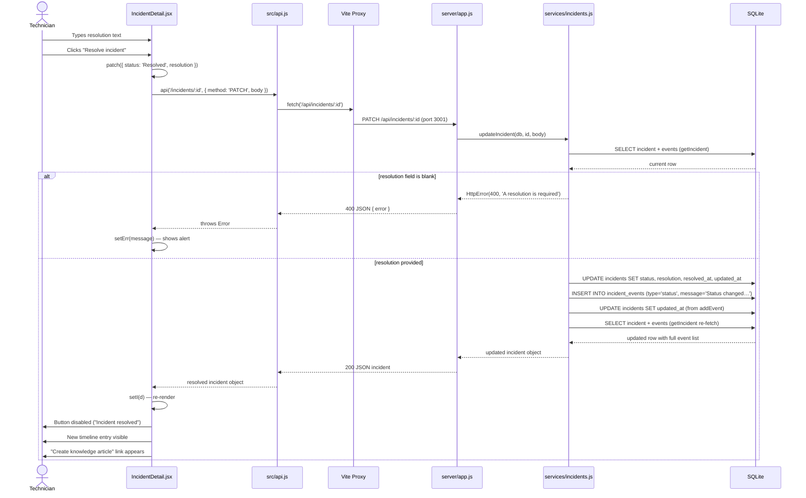
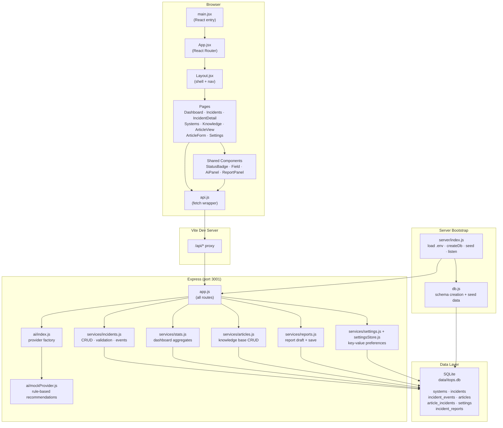

# Architecture Diagrams

## 1. Resolving an Incident — Sequence Diagram

When the technician clicks **Resolve incident**, the page calls `patch()` which is a thin wrapper around `api()` in [`src/api.js`](../src/api.js). The Vite dev server proxies `/api/*` to Express on port 3001. The route in [`server/app.js`](../server/app.js) delegates immediately to [`updateIncident()`](../server/services/incidents.js) in the incidents service. That function validates the status transition and enforces the rule that a resolution note is mandatory before marking an incident resolved. On success it writes three DB operations — an UPDATE on the incident row, an INSERT into `incident_events`, and a second UPDATE to `updated_at` — then re-fetches the full incident (with all events) and returns it. The response travels back through the same chain and React re-renders the page in place.

---

## 2. Project Component Diagram

The project is split into two independent processes. The **browser** side is a React SPA built with Vite — all navigation is client-side via React Router, and every network call goes through the single [`api.js`](../src/api.js) wrapper. In development, Vite proxies those calls to the **Express** server on port 3001; in a production deployment a real reverse proxy (e.g. nginx) would take that role. On the server, [`app.js`](../server/app.js) owns all route definitions and delegates immediately to one of five service modules — keeping route handlers trivial and business logic isolated. All services talk to a single SQLite file through Node's built-in `node:sqlite` module (no ORM, no npm driver). [`server/index.js`](../server/index.js) is the only entry point: it loads the environment, creates and seeds the database, then starts the Express app.
